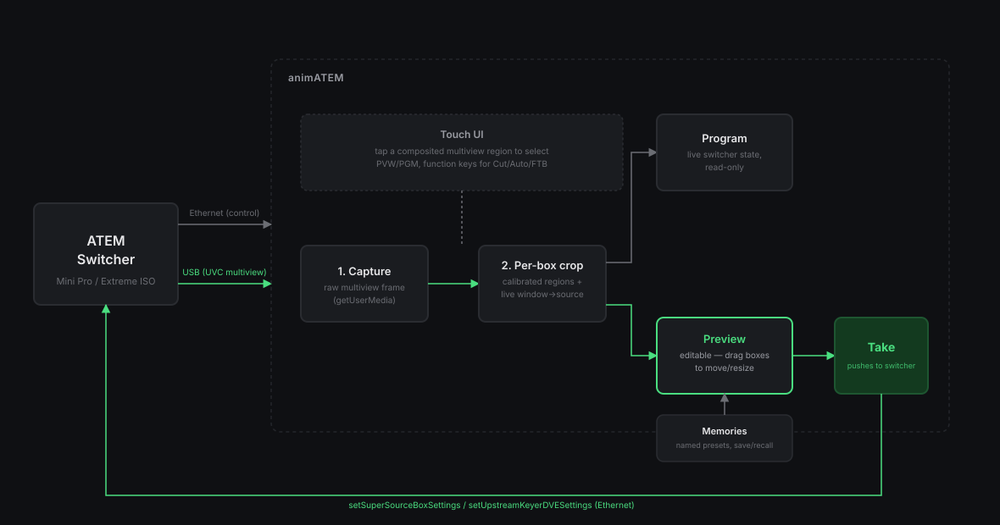
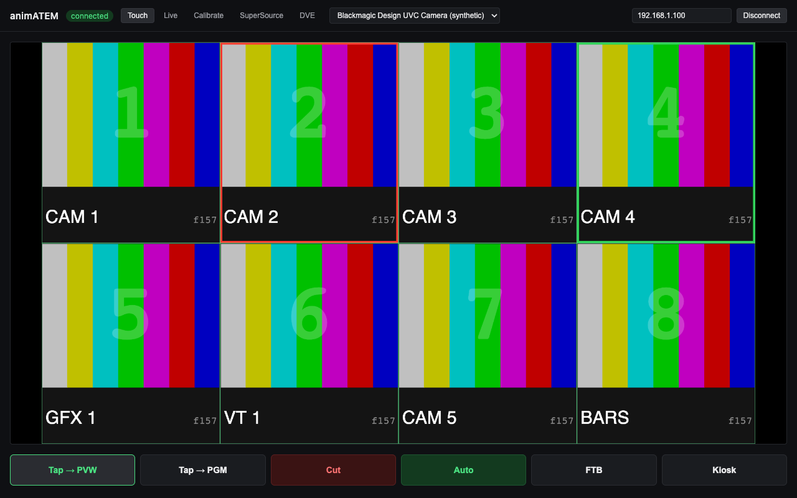
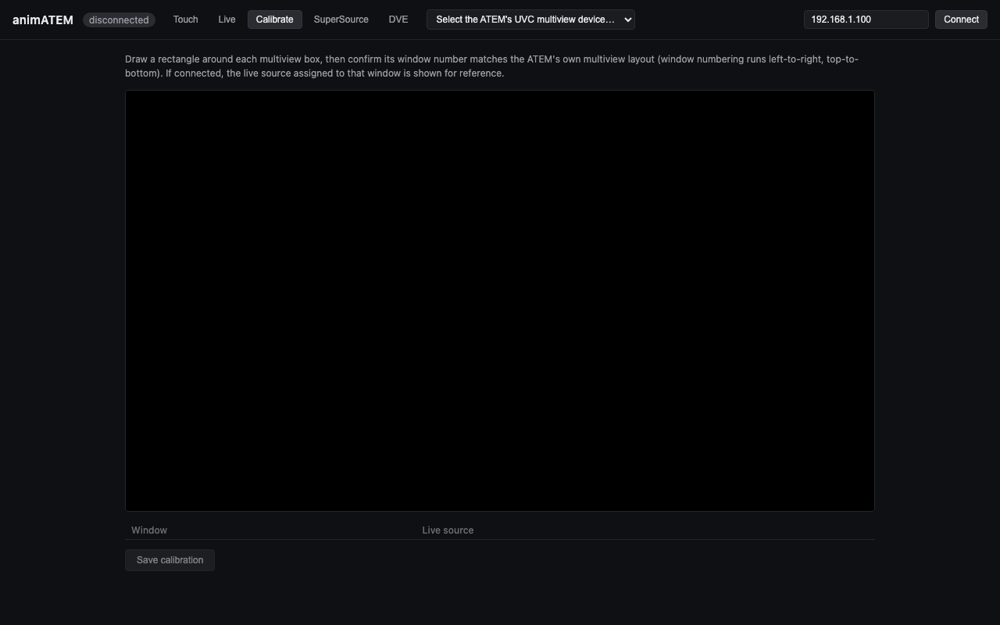
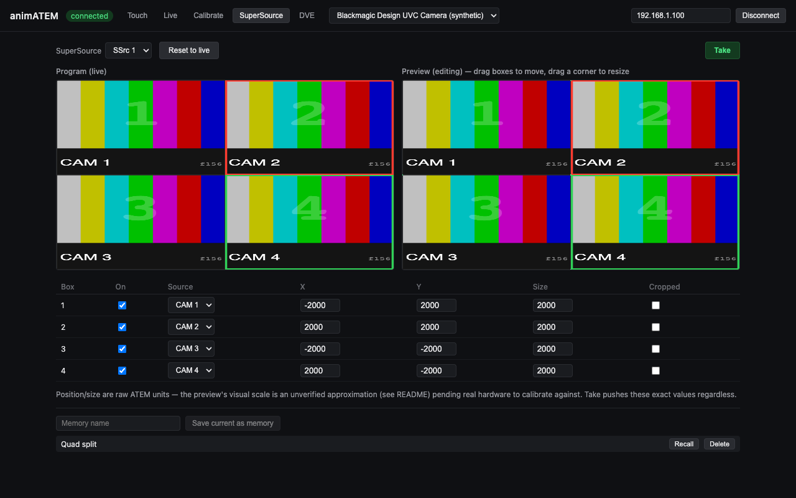
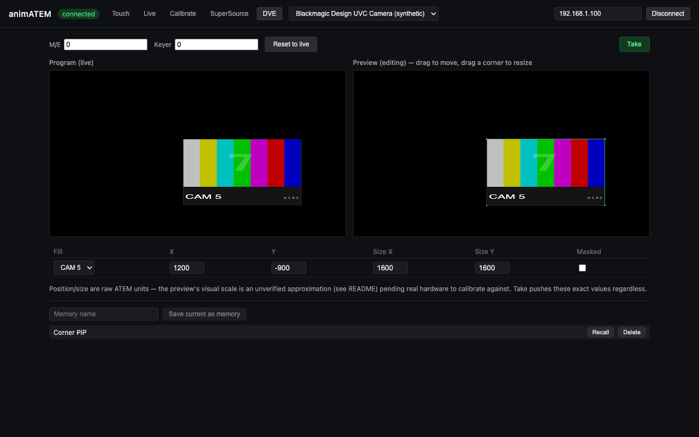
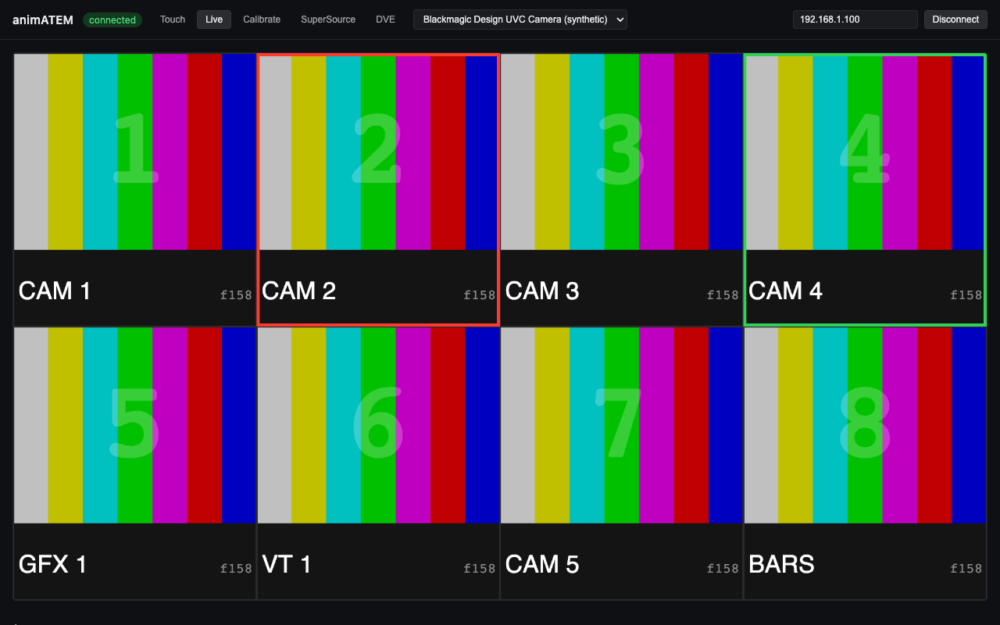

# animATEM

[](https://github.com/stoatworks-labs/animATEM/actions/workflows/ci.yml)

> **AI-assisted project.** This codebase was created with [Claude Code](https://claude.com/claude-code)
> (Anthropic), directed and reviewed by a human author. It has not yet been
> validated against real ATEM hardware.

Network control for Blackmagic ATEM switchers (Mini Pro/Extreme ISO family,
Phase 1), with standard PGM/PVW switching plus a software-composited
preview/program workflow for SuperSource and DVE box layouts.

Instead of building a synthetic preview from scratch, animATEM captures the
switcher's own multiview output over USB (it enumerates as a UVC webcam),
crops the individual source boxes out of that live multiview feed in
software, and recomposites them into an arbitrary custom arrangement to
preview SuperSource/DVE changes with real live pixels before they're pushed
to air. Named "memories" — app-level presets, independent of the ATEM's own
macro system — capture and recall these arrangements.

SuperSource box moves can also be **animated** rather than cut instantly: the
ATEM protocol itself has no native SuperSource tweening (unlike an upstream
keyer's DVE, which the switcher already animates in hardware via fly-
keyframes), so animATEM eases into the target layout client-side — a fixed-
cadence stream of interpolated positions, not a single instant command. Pick
a duration and hit "Animate" instead of "Take" in the SuperSource editor.

A [Bitfocus Companion](https://bitfocus.io/companion) module lives in its own
repo, [companion-module-animatem](https://github.com/stoatworks-labs/companion-module-animatem) — cut, auto and FTB per M/E, program,
preview and aux selection **by input name**, and SuperSource/DVE memory recall,
with program and preview tally. It talks to animATEM's local control server, so
there is nothing to set up on this side beyond having the app running.

<!-- downloads:start -->

## Download

**[v0.2.0](https://github.com/stoatworks-labs/animATEM/releases/tag/v0.2.0)** — prebuilt for macOS, Windows and Linux. Pick your platform:

<details>
<summary><b>macOS</b> — Apple Silicon, Intel</summary>

| Build | Download | Size |
| --- | --- | --- |
| Apple Silicon · .dmg disk image | [`animATEM-0.2.0-arm64.dmg`](https://github.com/stoatworks-labs/animATEM/releases/download/v0.2.0/animATEM-0.2.0-arm64.dmg) | 117 MB |
| Intel · .dmg disk image | [`animATEM-0.2.0.dmg`](https://github.com/stoatworks-labs/animATEM/releases/download/v0.2.0/animATEM-0.2.0.dmg) | 125 MB |
| Apple Silicon · .pkg installer | [`animatem-0.2.0-macos-arm64.pkg`](https://github.com/stoatworks-labs/animATEM/releases/download/v0.2.0/animatem-0.2.0-macos-arm64.pkg) | 117 MB |
| Intel · .pkg installer | [`animatem-0.2.0-macos-x64.pkg`](https://github.com/stoatworks-labs/animATEM/releases/download/v0.2.0/animatem-0.2.0-macos-x64.pkg) | 125 MB |
| Apple Silicon · .zip archive | [`animATEM-0.2.0-arm64-mac.zip`](https://github.com/stoatworks-labs/animATEM/releases/download/v0.2.0/animATEM-0.2.0-arm64-mac.zip) | 117 MB |
| Intel · .zip archive | [`animATEM-0.2.0-mac.zip`](https://github.com/stoatworks-labs/animATEM/releases/download/v0.2.0/animATEM-0.2.0-mac.zip) | 126 MB |

</details>

<details>
<summary><b>Windows</b> — x64 & ARM64, x64, ARM64</summary>

| Build | Download | Size |
| --- | --- | --- |
| x64 & ARM64 · .exe installer | [`animatem-0.2.0-setup.exe`](https://github.com/stoatworks-labs/animATEM/releases/download/v0.2.0/animatem-0.2.0-setup.exe) | 218 MB |
| x64 · .exe installer | [`animatem-0.2.0-x64-setup.exe`](https://github.com/stoatworks-labs/animATEM/releases/download/v0.2.0/animatem-0.2.0-x64-setup.exe) | 111 MB |
| ARM64 · .exe installer | [`animatem-0.2.0-arm64-setup.exe`](https://github.com/stoatworks-labs/animATEM/releases/download/v0.2.0/animatem-0.2.0-arm64-setup.exe) | 107 MB |
| x64 & ARM64 · portable .exe | [`animatem-0.2.0-portable.exe`](https://github.com/stoatworks-labs/animATEM/releases/download/v0.2.0/animatem-0.2.0-portable.exe) | 218 MB |
| x64 · portable .exe | [`animatem-0.2.0-x64-portable.exe`](https://github.com/stoatworks-labs/animATEM/releases/download/v0.2.0/animatem-0.2.0-x64-portable.exe) | 111 MB |
| ARM64 · portable .exe | [`animatem-0.2.0-arm64-portable.exe`](https://github.com/stoatworks-labs/animATEM/releases/download/v0.2.0/animatem-0.2.0-arm64-portable.exe) | 107 MB |
| x64 · .zip archive | [`animATEM-0.2.0-win.zip`](https://github.com/stoatworks-labs/animATEM/releases/download/v0.2.0/animATEM-0.2.0-win.zip) | 145 MB |
| ARM64 · .zip archive | [`animATEM-0.2.0-arm64-win.zip`](https://github.com/stoatworks-labs/animATEM/releases/download/v0.2.0/animATEM-0.2.0-arm64-win.zip) | 144 MB |

</details>

<details>
<summary><b>Linux</b> — x64, ARM64</summary>

| Build | Download | Size |
| --- | --- | --- |
| x64 · .deb package (Debian/Ubuntu) | [`animatem_0.2.0_amd64.deb`](https://github.com/stoatworks-labs/animATEM/releases/download/v0.2.0/animatem_0.2.0_amd64.deb) | 96 MB |
| ARM64 · .deb package (Debian/Ubuntu) | [`animatem_0.2.0_arm64.deb`](https://github.com/stoatworks-labs/animATEM/releases/download/v0.2.0/animatem_0.2.0_arm64.deb) | 91 MB |
| x64 · .rpm package (Fedora/RHEL) | [`animatem-0.2.0.x86_64.rpm`](https://github.com/stoatworks-labs/animATEM/releases/download/v0.2.0/animatem-0.2.0.x86_64.rpm) | 85 MB |
| ARM64 · .rpm package (Fedora/RHEL) | [`animatem-0.2.0.aarch64.rpm`](https://github.com/stoatworks-labs/animATEM/releases/download/v0.2.0/animatem-0.2.0.aarch64.rpm) | 80 MB |
| x64 · AppImage | [`animATEM-0.2.0.AppImage`](https://github.com/stoatworks-labs/animATEM/releases/download/v0.2.0/animATEM-0.2.0.AppImage) | 124 MB |
| ARM64 · AppImage | [`animATEM-0.2.0-arm64.AppImage`](https://github.com/stoatworks-labs/animATEM/releases/download/v0.2.0/animATEM-0.2.0-arm64.AppImage) | 124 MB |

</details>

All builds, checksums and release notes: [github.com/stoatworks-labs/animATEM/releases](https://github.com/stoatworks-labs/animATEM/releases).

macOS builds are signed and notarised and open normally. The Windows builds are unsigned, so SmartScreen warns once — see [Windows SmartScreen & Defender Firewall](#windows-smartscreen--defender-firewall) for the one-time click-through.

<!-- downloads:end -->

## Concept



## Screenshots

The multiview boxes below are a synthetic test-pattern feed (colour bars, big numbers, source labels), not a real ATEM's output — a stand-in so these screenshots don't depend on hardware being connected. Everything else — the app chrome, data tables, and layouts — is the real UI.

The touchscreen operator view — a composited multiview with tap-to-select regions and a function key row below it:



The calibration screen, where an operator draws each multiview box's region once per capture resolution — or auto-creates a starting grid sized to the live window count and drags boxes/corners into place:



The SuperSource editor — Program (live) and Preview (editable, drag to move/resize) panes side by side, plus the memory bank:



The DVE editor, same Program/Preview/Take pattern applied to a single upstream keyer:



The raw multiview passthrough and live ATEM state, useful while wiring things up:



## Stack

Electron + `electron-vite` + React + TypeScript, following the same
conventions as this author's other Electron control apps
(`presentation-commander-client/server`, `MicWizard`):
`src/{main,preload,renderer,shared}`, service classes under
`src/main/services/*.ts`.

ATEM Ethernet protocol control via
[`atem-connection`](https://github.com/Sofie-Automation/sofie-atem-connection)
(main process — UDP). UVC multiview capture via the renderer's
`navigator.mediaDevices.getUserMedia` (full Chromium context, no native
addon needed).

## Documentation

| Doc | Contents |
|---|---|
| [docs/USER-GUIDE.md](docs/USER-GUIDE.md) | Operating it: multiview setup, calibration, Preview/Take, animation, memories, troubleshooting |
| [docs/API.md](docs/API.md) | The control-server protocol, state model, coordinate conversions, memories file format, IPC channels |
| [docs/DEVELOPING.md](docs/DEVELOPING.md) | Build, tests, and the coordinate work that is the hard part |

## Development

```sh
npm install
npm run dev
```

`npm run typecheck` and `npm run lint` before committing.

**Known install gotcha on this machine (Node v26.5.0):** `electron`'s
postinstall uses `extract-zip@2.0.1`, whose promise hangs forever on this
Node version instead of extracting or erroring — `npm install` finishes
but `node_modules/electron/dist` is left with no `Electron.app`, and `npm
run dev` fails with `spawn .../Electron ENOENT`. If that happens:

```sh
# find the cached zip extract-zip already downloaded
find ~/Library/Caches/electron -iname "electron-v*.zip"

# extract it with the system unzip instead (fast, doesn't hang)
rm -rf node_modules/electron/dist
mkdir -p node_modules/electron/dist
unzip -q <path-to-the-zip-above> -d node_modules/electron/dist

# recreate the marker file install.js normally writes (no trailing newline!)
printf "Electron.app/Contents/MacOS/Electron" > node_modules/electron/path.txt
```

### Testing

```sh
npm run test
```

Unit tests cover the pure box-geometry/drag/coordinate-conversion math and
the file-backed calibration/memory stores (`vitest`, no hardware needed).
The Companion module now lives in [its own repo](https://github.com/stoatworks-labs/companion-module-animatem) and carries its own
tests. CI (`.github/workflows/ci.yml`) runs typecheck/lint/test on every push
and PR; `.github/workflows/release.yml` builds installers for
Windows/macOS/Linux (x64 + arm64) on a `v*` tag.

## Status

Phase 1 feature set is built: ATEM connection (standard switching — cut/
auto/FTB/program/preview/aux), UVC multiview capture, box calibration,
the SuperSource and DVE Program/Preview/Take workflow with drag-to-move/
resize editing, named memories, and the touchscreen operator UI with
kiosk mode. Everything has been exercised in isolated browser/Electron
harnesses (typecheck, lint, and functional checks all pass), but **none
of it has been run against a real ATEM switcher yet** — the coordinate
scale used for the Preview panes' visual layout (see `superSourceCoords.ts`
/ `dveCoords.ts`) is a labeled placeholder pending real hardware to
calibrate against, and the UVC capture path has only been exercised
against a generic webcam, not a real ATEM's multiview output.

Requires an ATEM Mini Pro/Extreme ISO with its USB output set to
**Multiview** (not the default Program) for the compositing workflow to
work.

The local control server (`ws://127.0.0.1:51234`) and the
[Companion module](https://github.com/stoatworks-labs/companion-module-animatem) that talks to it are also
built and verified end-to-end — a real WebSocket client (including the
module's own compiled client code) connects, receives the initial status/
snapshot/memories state, and round-trips commands against a running
animATEM instance without errors. Like everything else, actual command
behavior (cut/auto/recall) hasn't been checked against a real switcher yet.

Production packaging is verified too: `npm run build:mac` produces working
signed-nothing (no Apple dev cert yet) x64 + arm64 `.dmg`/`.zip` installers,
and the packaged arm64 `.app` boots cleanly on its own — full Electron
process tree comes up, the control server binds correctly — separate from
every other check in this project, which has run through `npm run dev`.

## ⚠️ Security note

The local control server (`src/main/services/controlServer.ts`) binds to
`127.0.0.1:51234` with **no authentication** — anything that can reach that
port on the local machine can cut/auto/FTB the switcher or recall a memory.
This is fine as long as it stays bound to localhost (the default, and the
only configuration this app currently supports). If you ever change that
binding to `0.0.0.0` or another network-reachable address, add
authentication first — as shipped, it is not safe to expose beyond
localhost.

## Windows SmartScreen & Defender Firewall

macOS builds are **Developer ID-signed and notarised by Apple** — they open
normally, with no Gatekeeper warning and no quarantine step. The Windows
binaries are **not** code-signed, so Windows still warns you the first time.

- **Windows** — SmartScreen shows *"Windows protected your PC"* →
  **More info** → **Run anyway**.
- **Windows Defender Firewall** — first launch pops *"Allow animATEM to communicate on
  these networks"*. Tick **Private** (and **Domain** on a managed network) — animATEM
  needs it to reach the ATEM switcher and expose its Companion control port. Deny it and
  the switcher will show as offline and Companion won't connect.
- **Linux** — no signing gate.

Per-artifact steps, self-signing, checksum verification and the Defender Firewall reset
procedure: **[docs/UNSIGNED.md](docs/UNSIGNED.md)**.

## Roadmap / TODO

- [ ] **Validate against a real ATEM** — run the full compositing workflow and cut/auto/recall command behavior against a real Mini Pro/Extreme ISO (everything so far is verified only in browser/Electron harnesses).
- [ ] **Calibrate coordinate scale** — the SuperSource/DVE Preview layout scale (`superSourceCoords.ts` / `dveCoords.ts`) is a labeled placeholder pending real hardware to calibrate against.
- [ ] **Real multiview capture** — the UVC capture path has only been exercised against a generic webcam, not a real ATEM's multiview output.

<!-- attributions:start -->
This project is built on other people's work — see [ATTRIBUTIONS.md](ATTRIBUTIONS.md).
<!-- attributions:end -->
